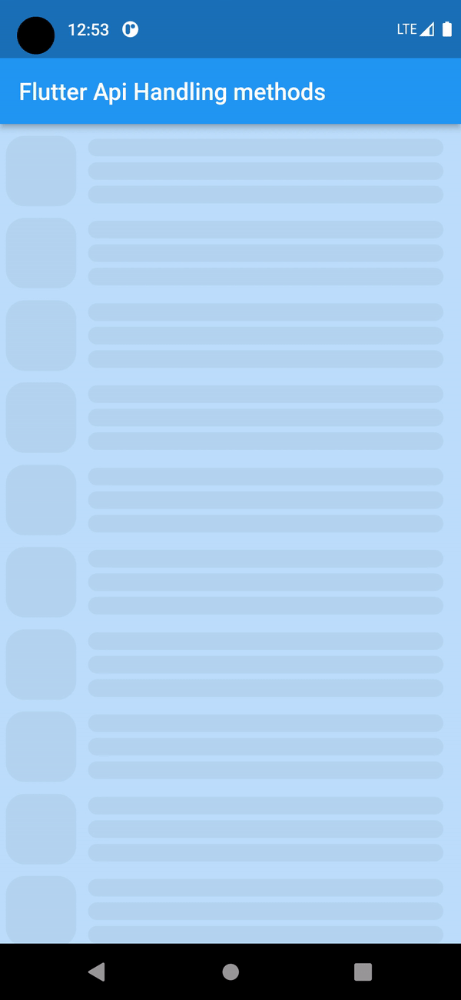
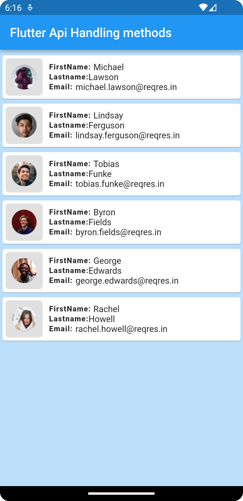

# flutter_api_handling_methods

flutter api handling methods samples

## FrameWork
1. Flutter

## Language:
1. Dart

## Tools:
1. Git
2. Android studio / Vscode

## Pre-requirement:
1. Flutter 3.3.10
2. Dart 2.18.6
3. http: ^0.13.5


# Cli command
## check your flutter support info:

```
flutter doctor
```
## dependancy install / package install:
```
flutter pub get
```
## Run methods:
```
flutter run
```

### ✌&ensp;Preview

|            Gif preview             |           api informatation           |
|:----------------------------------:|:-------------------------------------:|
|  |  |